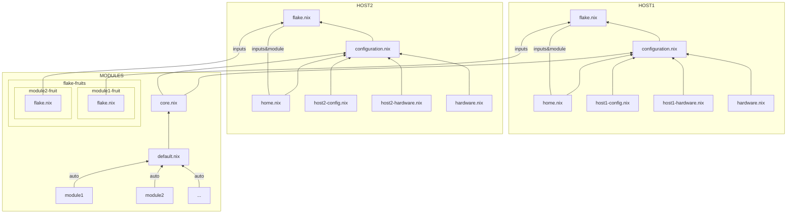

Bare fruits-nix framework.
Just a skeleton to get a rough idea of the structure,
or slowly transition by grabbing the template files.

## Overview chart

(broken on codeberg for some reason)




## Bootsratp

(from a fresh install)

### Starter Config

In the starter-config, add/edit the hostname, and add git to the packages.
I also like to add convienence packages:
An editor: helix/neovim. Multi-plexer zellij. And yazi and lazygit for navigation of files and repos.

Enable flakes with
```
  nix.settings.experimental-features = [
    "nix-command"
    "flakes"
  ];
```

This is now a nice and bare fall-back config.
Rebuild with `nixos-rebuild switch`.

### Get fruits-nix

```
git clone <link-to-repo>
```

Instructions assume you cloned under your home folder, and renamed the repo "nixos-config".
Adjust accordingly.

### Prepare config

#### Merge with generated
Copy the generated config so we have them in the repo.
I like to just have it in the home folder.

```
cd <repo>
mkdir hosts/<host>/temp
cp /etc/nixos/configuration.nix hosts/<host>/temp
cp /etc/nixos/hardware-configuration.nix hosts/<host>
```
As of the current setup, the only thing that needs merging is the
`boot.initrd.luks.devices."luks-<device-id>".device = "<disk-uuid-path>"`
for some reason it is generated in `configuration.nix` instead of `hardware-configuration.nix`.
I like to place it in `<host>-hardware.nix`

### TODO's

Now follow the [[TODO]] file.
